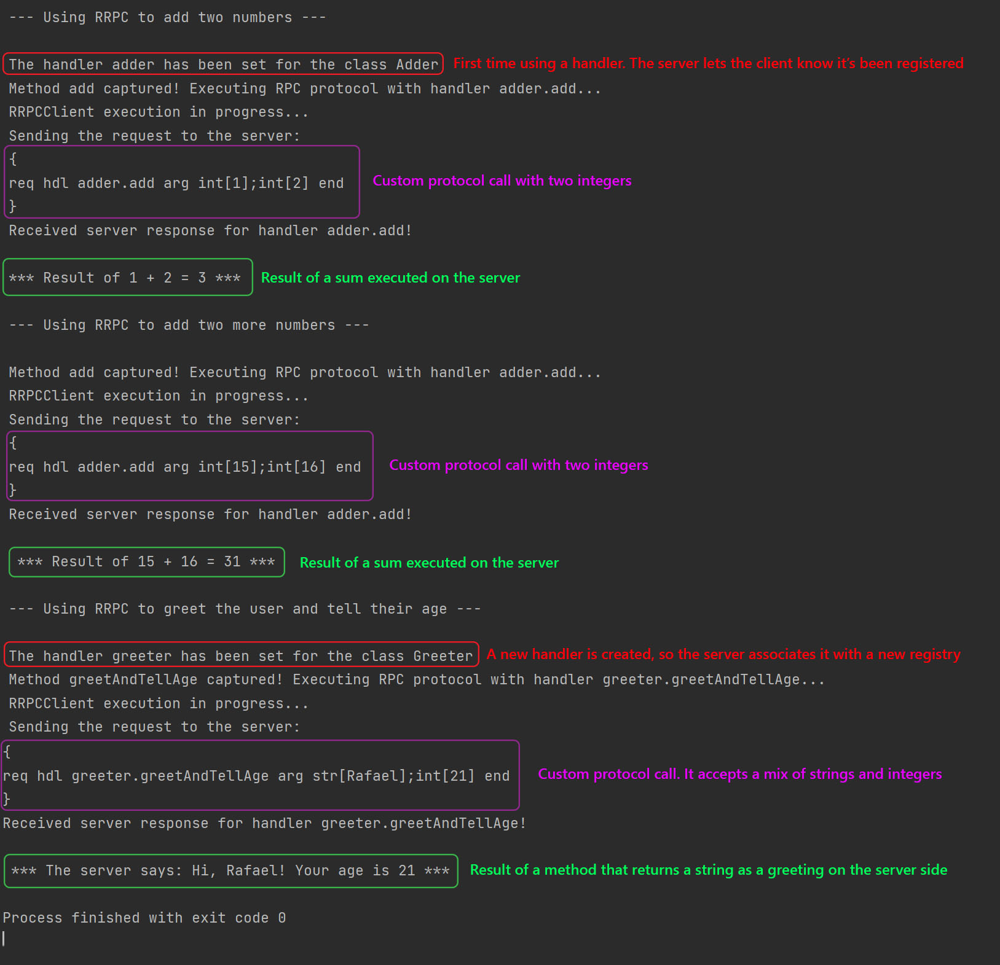
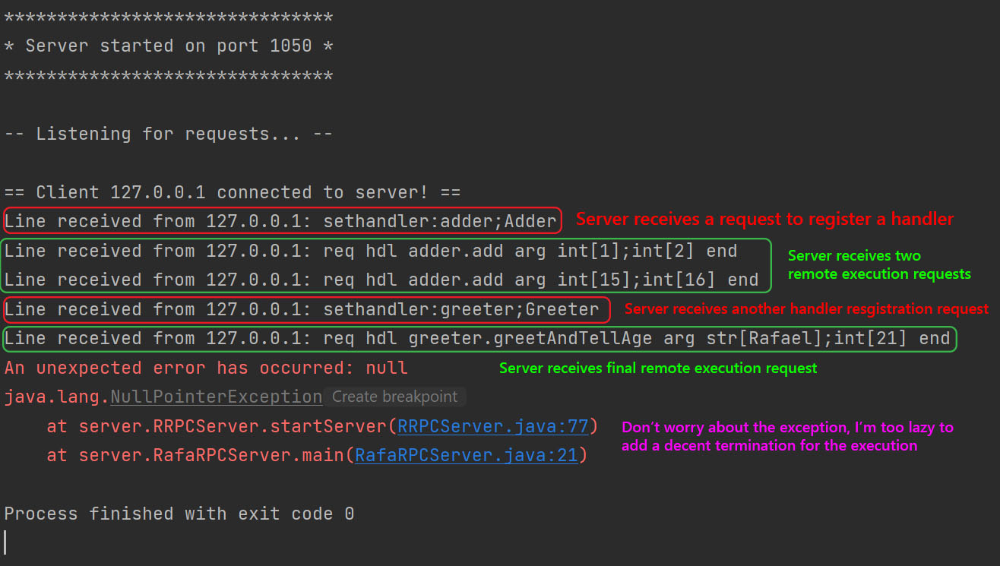

# RRPC
Rafa's Remote Procedure Call (RRPC) is an implementation of the RPC protocol that uses a custom hand-made request-response language. It allows a client to connect to a server and execute functions which are implemented in the server, so that the client only has to provide the function to be executed and its methods and the server will respond with a result. It is meant to be a small personal project to understand how RPC works, so RRPC only allows the execution of remote methods that accept Strings and/or Integers as arguments.

Unlike XML-RPC, this protocol uses interfaces that the client has in their local machine, so that the IDE can help the developer when calling specific methods, instead of passing the method to be executed as a string.

The implementation of the protocol is very easy from the client's perspective:

1. You create an instance of RRPCClient and call the startClient() method that will connect to a default address and port, or you specify them in the arguments of the constructor.
2. You instantiate an interface you would like to use (remember, you, as the client, don't have the implementations of the interfaces, just the contracts).
3. You use the RRPCProxy.getProxy method to register the handler you want to use for that interface. You also pass in the class of the interface you're using and the instance of the RRPCClient you have. The client will then ask the server to register the new handler and the server will do that if it doesn't have a handler with that named registered yet.
4. You use all the methods of the interface you want. Every time you call a method, the RRPCProxy class will intercept the invocation and instead send a remote execution request to the server, which will execute the method and respond with the result.
5. You assign the result to a variable and, voilà! You have executed a remote method using RRPC!

